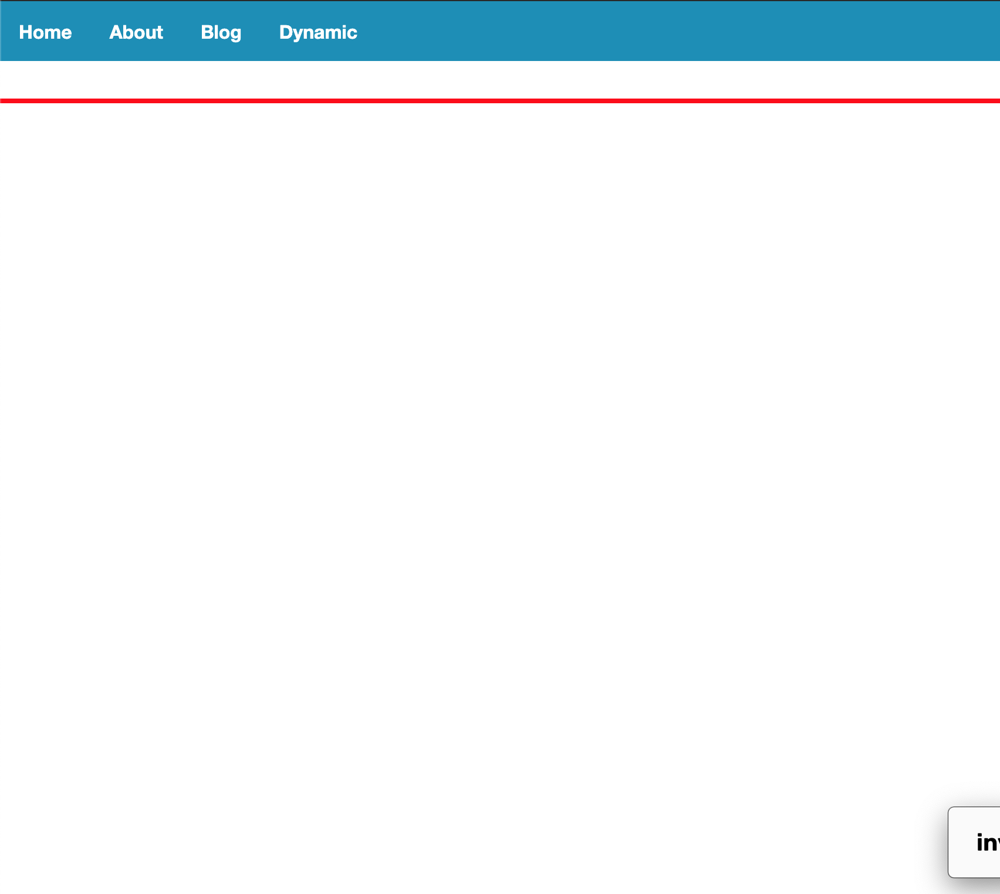
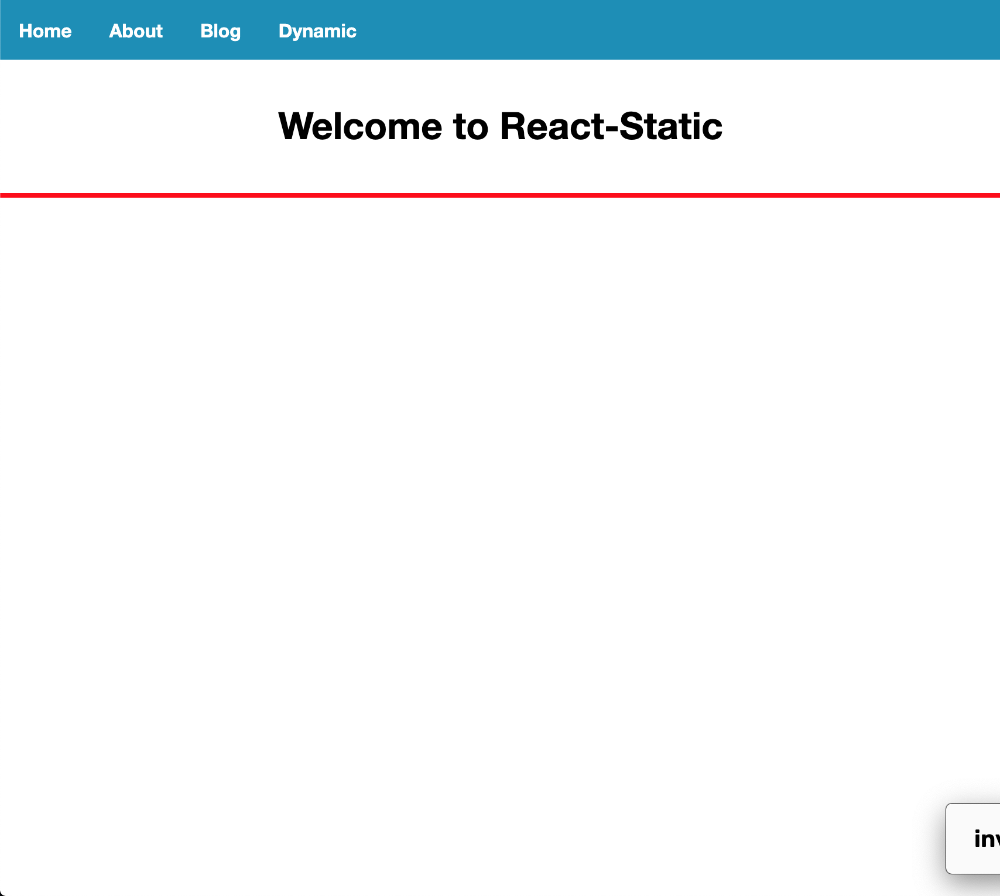
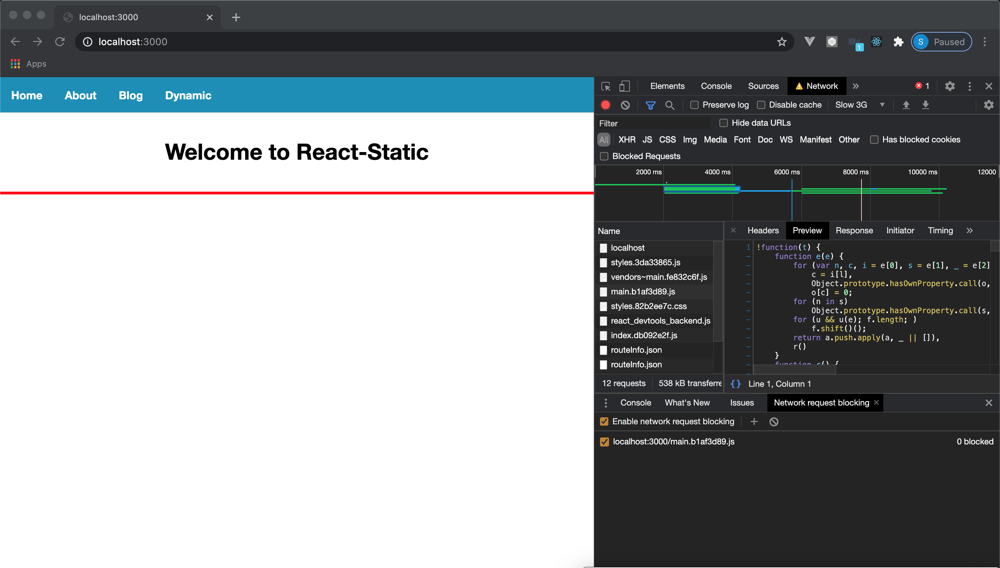

# React Static w/ React-Router issue on rehydrate on client-side

This repo is a demo of an issue when using `react-router` w/ `react-static`.

The setup has been done using the plugin `react-static-plugin-react-router` and following the [instruction in the documentation](https://github.com/react-static/react-static/blob/master/docs/guides/dynamic-routes-react-router.md) (including the [Dynamic Routes with React Router guide](https://github.com/react-static/react-static/blob/dbf750c9e8c74a2662060e387c983f11021b31aa/docs/guides/dynamic-routes-react-router.md))

## How to run
1. run `yarn`
2. run `yarn build && yarn serve`
3. go to `http://locahost:3000`

## The issue

When using `react-router` w/ `react-static`, I have a "flickering" issue on rehydratating the page on the client-side (cf. screenshot below)

The flicker doesn't seem to happen when I block the `main.js` file from loading or if I import the page component in the App.js (cf. [App.js](./src/App.js) comment line 6)

### First print when `main.js` file is blocked from loading using the devtool

